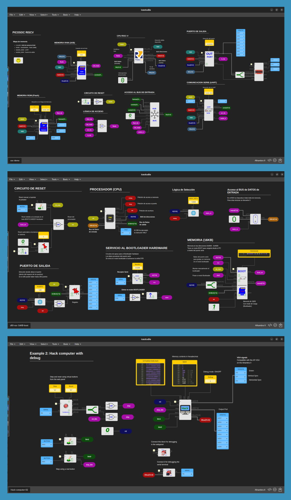

<!-- ### A beginner-friendly FPGA development board designed for students, makers and engineers. -->

### A beginner-friendly FPGA dev board designed for learning.

 

<!-- 

  
  
  

 -->

  <a href="/docs/hardware-overview" class="cta-btn secondary" style="display: inline-flex; align-items: center; gap: 8px; padding: 10px 24px; border-radius: 8px; text-decoration: none; font-weight: 600; background: var(--hextra-colors-background-secondary, #e5e7eb); color: var(--hextra-colors-text, #374151);">
     Details
  </a>
  <a href="https://www.crowdsupply.com/ashoktinkeringlabs/soan-papdi" class="cta-btn primary" style="display: inline-flex; align-items: center; gap: 8px; padding: 10px 24px; border-radius: 8px; text-decoration: none; font-weight: 600; background: #3b82f6; color: white;">
     Crowd Supply
  </a>

  <model-viewer
    src="./models/soan-papdi.glb"
    camera-controls
    auto-rotate
    rotation-per-second="6deg"
    auto-rotate-delay="3"
    interaction-prompt="visible"
    camera-orbit="0deg 0deg 80%"
    shadow-intensity="1.5"
    shadow-softness="1"
    environment-image="neutral"
    exposure="1.1"
    style="width: 100%; max-width: 800px; height: 450px; border-radius: 16px; background-color: var(--hextra-colors-background-secondary, #111827); box-shadow: 0 20px 40px -10px rgba(0,0,0,0.5); border: 1px solid var(--hextra-colors-border, #374151); overflow: hidden;">
  </model-viewer>

<!-- ------------------- -->
<!-- 

  <model-viewer
    src="./models/soan-papdi.glb"
    camera-controls
    camera-orbit="0deg 75deg 80%"
    shadow-intensity="1"
    environment-image="neutral"
    exposure="1.0"
    style="width: 100%; max-width: 800px; height: 400px; border-radius: 12px; background-color: var(--hextra-colors-background-secondary, #f9fafb);">
  </model-viewer>

 -->
<!-- ------------------- -->






  **The design is intentional:** \
  Just the FPGA, Flash memory, a USB-C port for power and loading circuits, and basic Input/Output to keep you focused on learning.


 

## New to FPGAs?

Most FPGA boards are designed for experienced engineers. You spend hours hunting for components, wiring up circuits, and debugging setups before writing a single line of code. **Soan Papdi is different.**


  
  


  

 

### No Complex HDL Needed

No complicated installation flow. No lame driver installation. Download the IDE, double-click, and get started! Program it using the open-source **iCEStudio IDE** or use RAW HDL.


  


 

## Why this design?

Soan Papdi is designed for learning — every component has a reason.

### ➜  Output LEDs (D7–D0)

On top, we have 8 output LEDs (D7 to D0). These aren't random. We chose 8 yellow LEDs because 8-bit data is fundamental to digital systems. When you build things like counters, shift registers, state machines, or simple processors, you can visualize the output directly on the LEDs in real-time.

**

### ➜  Status LEDs (S3–S0)

Right next to the output LEDs are 4 white LEDs for status signals. Use them for carry flags, overflow indicators, error signals, or any custom status output — so you can see exactly what's happening inside your circuit at a glance.

### ➜  Input Switches (A3–A0 & B3–B0)

At the bottom side of the board, we have two sets of switches (Set A and Set B). These let you input two 4-bit values directly into your FPGA design. Build an adder, subtractor, comparator, or simple calculator, then change the inputs and observe the results instantly.

### ➜  GPIO Pins (IO0–IO9)

On the right side of the board, 10 GPIO pins let you go beyond the onboard peripherals. Connect sensors, displays, motors, or your own custom hardware to extend the capabilities of Soan Papdi.

**

 

## Specification

<!-- | Feature | Description |
|---|---|
| **FPGA** | Lattice iCE40UP5K FPGA |
| **Logic Resources** | 5,280 LUTs (capable of hosting RISC-V soft-core CPUs) |
| **Memory** | 120 Kbit Block RAM + 1 Mbit (128 KB) Single-Port SPRAM |
| **Clocking** | On-chip PLL, Internal Oscillators: 10 kHz and 48 MHz |
| **Hard IP & DSP** | 2 × SPI, 2 × I²C, 8 × DSP multiplier blocks |
| **Storage** | 128 Mbit onboard SPI Flash |
| **User Interface** | 8× yellow LEDs, 4× white status LEDs, 8× DIP switches, 2× push buttons |
| **Expansion** | 10 × I/O pins for external sensors & peripherals |
| **USB & Power** | USB-C (5V), fully controlled by FPGA (no external MCU), DFU bootloader |
| **Toolchain** | iCE Studio, APIO, Yosys, nextpnr, IceStorm, Icarus Verilog, Amaranth HDL | -->


  
  
  
  
  
  
  
  
  
  
  
  
  
   


 

## Learning Resources

To make things easier, **Piyush Itankar** has created a Digital Electronics 101 course, where everything is explained step-by-step.


  


Start simple — build basic gates like AND, OR, or a decoder. Once you're comfortable, move on to advanced projects:

1. **[RISC-V CPU](https://github.com/Obijuan/RISC-V-FPGA)** — A RISC-V processor implementation
2. **[Z80 CPU](https://github.com/Obijuan/Z80-FPGA)** — A recreation of the classic Z80 processor
3. **[Hack CPU](https://github.com/Obijuan/nand2tetris-icestudio)** — The Nand2Tetris Hack CPU, built gate by gate

<!--  -->

Looking for more inspiration? Browse the full **[iCEstudio Example Collection](https://github.com/FPGAwars/icestudio/wiki#organization-of-the-collection)**.

 

## The Team

Hardik & Lakshya created and built Soan Papdi from the ground up, turning an idea proposed by Piyush into a fully realized FPGA development board.

  

    
    <h3 style="margin: 0; font-size: 1.25rem; color: var(--hextra-colors-text, #111827);">Hardik Seth</h3>
    
<strong>Embedded Engineer</strong> STEMpedia

    

      <a href="https://www.linkedin.com/in/hardik-seth-8687b7201/">LinkedIn</a> • 
      <a href="https://x.com/DIY_With_Hardik">X</a> • 
      <a href="https://www.youtube.com/@DIYwithHardik">YouTube</a>
    

    
Engineer by day, Maker by night - playing with electronics since the age of 9. From childhood, I’ve loved tearing things apart, rebuilding them, and learning through hands-on experimentation. Currently working as an embedded engineer who designs PCBs, writes firmware, and enjoys turning ideas into complete, working hardware products.

  

  

    
    <h3 style="margin: 0; font-size: 1.25rem; color: var(--hextra-colors-text, #111827);">Piyush Itankar</h3>
    
<strong>Senior Embedded SW Engineer</strong> Google | Ex-Intel

    

      <a href="https://www.linkedin.com/in/streetdogg/">LinkedIn</a> • 
      <a href="https://x.com/_streetdogg">X</a> • 
      <a href="https://www.youtube.com/@pyjamacafe">YouTube</a>
    

    
Electrical Engineer holding a Master’s degree in Embedded Systems, with a proven track record at industry giants. Currently thriving as an Embedded Software Engineer at Google, drove innovation in Firmware development for the Power Management Sub-system on Tensor SoCs and presently advancing system software for the Pixel Watch.

  

  

    
    <h3 style="margin: 0; font-size: 1.25rem; color: var(--hextra-colors-text, #111827);">Lakshya Seth</h3>
    
<strong>Digital Craftsman</strong> Class 12th Student

    

      <a href="https://www.linkedin.com/in/lakshyaseth7089/">LinkedIn</a> • 
      <a href="https://x.com/lakshya7089/">X</a> • 
      <a href="https://www.youtube.com/@lakshyaseth7089">YouTube</a>
    

    
Love to build things, breaking and tearing things apart, to really learn how it's working, and what I can build with it. I like to play with Arch Linux and electronics. Currently, I'm in 12th grade and trying to get into an engineering college.

  

 

  Made with ❤️ in India.

