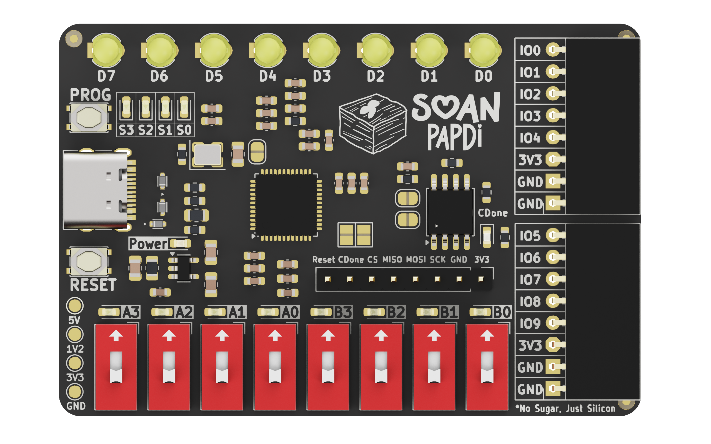

Welcome to the official Soan Papdi FPGA documentation.

Whether you're blinking your first LED or building custom Verilog designs, this guide will help you get started and turn your ideas into working hardware.

 

## Where should I start?

New to Soan Papdi? Start with a quick look at the hardware, then try visual programming with iCE Studio


  
  


<!-------------------------------------------------------------------------->

 

## Learn & Build

Ready to build something? Follow our step-by-step guides and hands-on examples.

### For Beginners — Visual Programming

Build FPGA projects using iCE Studio's visual blocks - no HDL required.


  


### For Advanced Users — Verilog

Ready to work closer to the hardware? Learn Verilog and build your own FPGA designs.


  
  


<!-------------------------------------------------------------------------->

 

## Resources & Support

Everything you need to set up your tools, program your board, and troubleshoot common issues.


  
  
