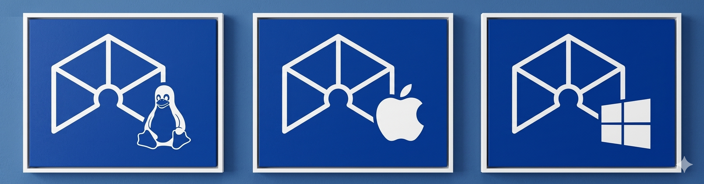
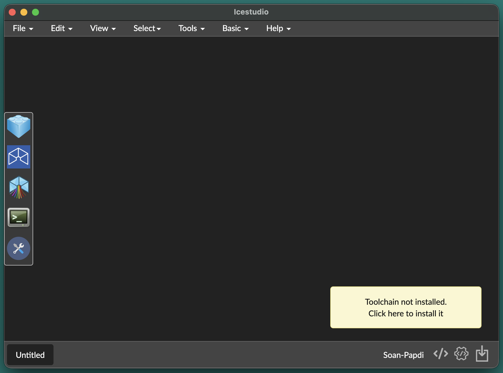
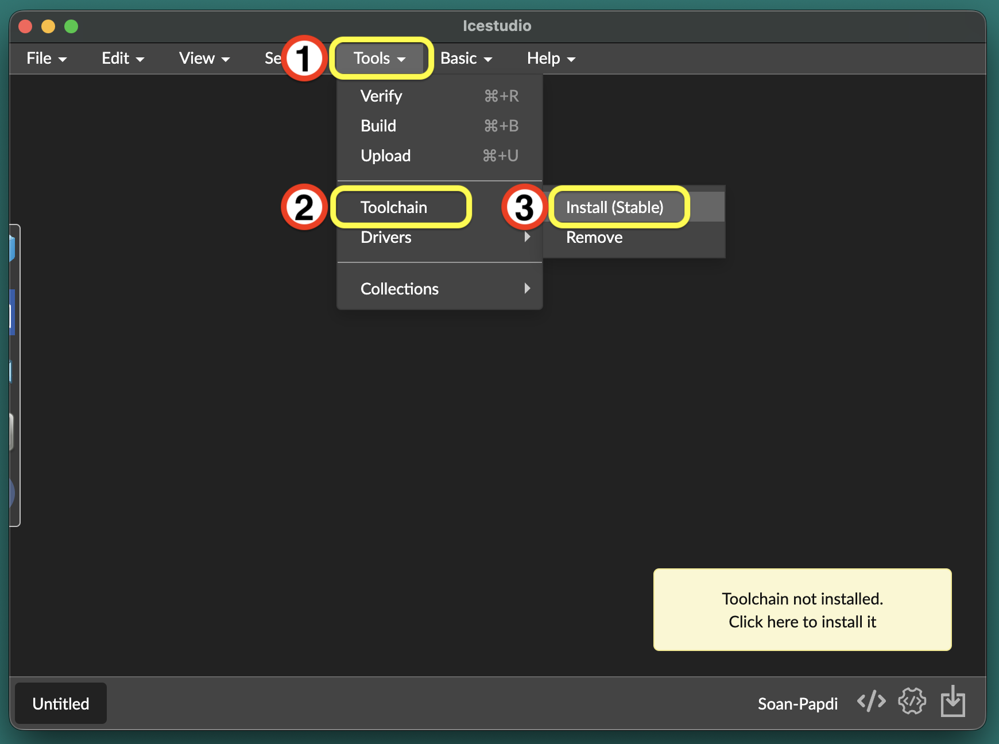
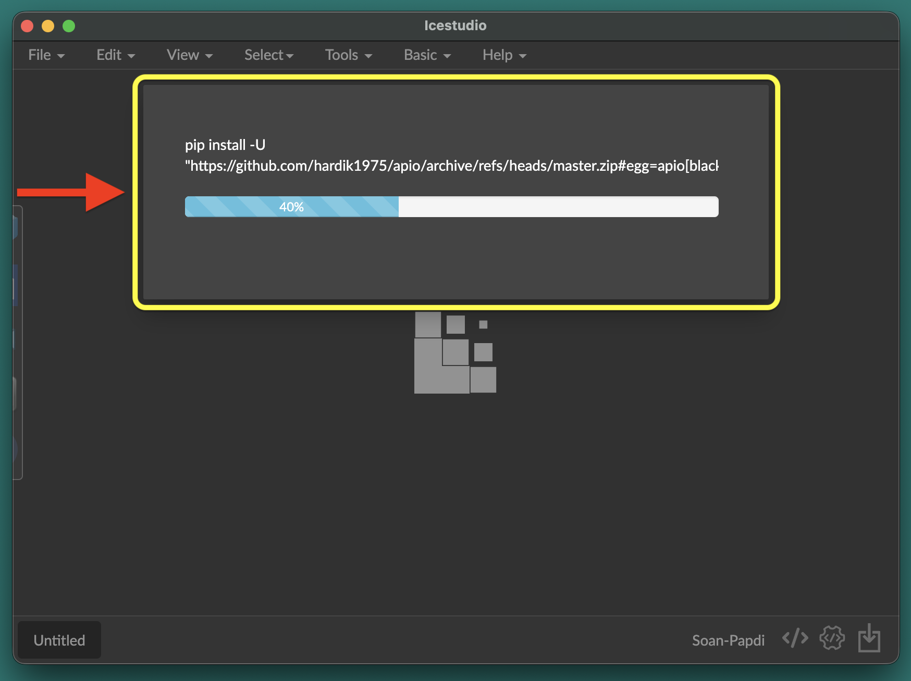
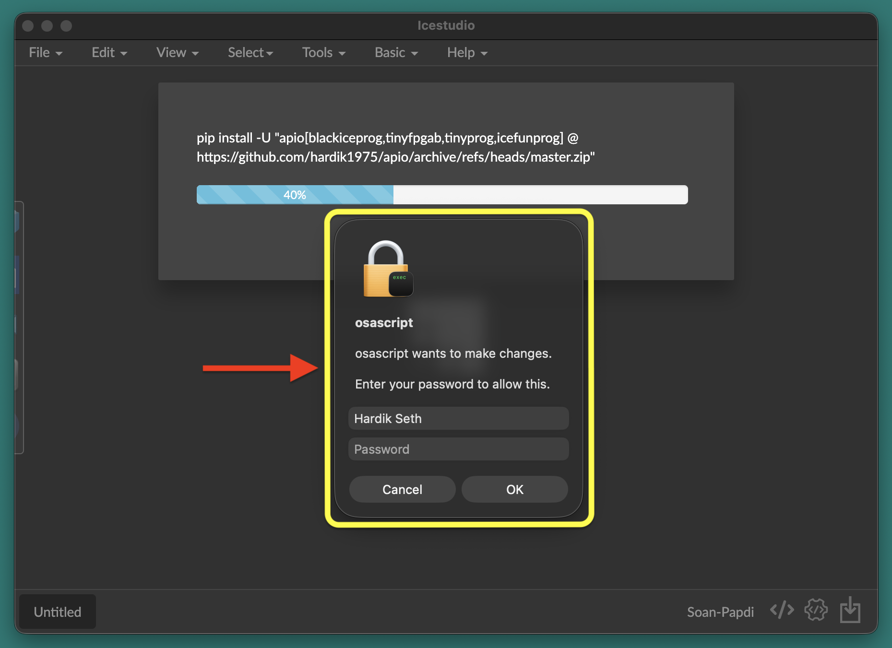
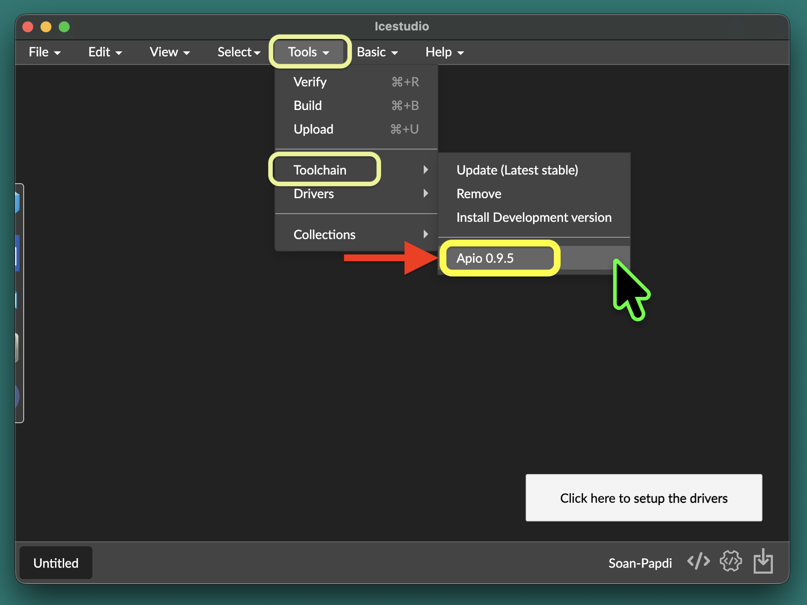

In this section, you'll install iCE Studio and set up the FPGA toolchain required to program your Soan Papdi board.

By the end, you'll have everything ready to build and upload your first FPGA design.

### What You'll Need

Before getting started, make sure you have the following:

1. **Computer** — Windows, macOS, or Linux.
2. **Internet connection** — required to download iCE Studio and the toolchain.
3. **Python 3.12 or later** — required by the toolchain.

Once you have everything ready, you're all set to install iCE Studio and build your first FPGA project.

{}

### Download iCE Studio

Download the iCE Studio for your operating system:

<!-- Stable Release (Windows, Linux & macOS):  -->


  
  
  


<!-- Latest: -->

<!-- 
  
 -->

<!-- Soan Papdi support has already been contributed to iCE Studio and will be available in a future official release. Until then, please use the Soan Papdi build linked above, which includes all the required support out of the box. -->

### Opening iCE Studio

Install iCE Studio just like any other desktop application. When you launch it for the first time, you'll see the following screen:

You'll notice a popup in the bottom right saying: \
`"Toolchain not installed. Click here to install it"` — perfect timing, because that's exactly what we're doing next!

<!-- ### Step subheading {class="no-step-marker"} -->
### Installing the Toolchain (Apio)

Before you can build and upload circuits to Soan Papdi, you need to install the FPGA toolchain. Think of it as the engine that powers iCEStudio.

In iCEStudio, go to **Tools → Toolchain → Install (Stable)**.

The toolchain will begin downloading.

During installation, you may be asked to enter your system password. This allows iCE Studio to install the required dependencies.

### Verify the Toolchain Installation

After the installation finishes, verify that everything was installed correctly.

Open **Tools → Toolchain** and confirm that **Apio 0.9.5** is listed.

**You're all set! 🎉**

iCE Studio and the FPGA toolchain are now installed.

### Turn on an LED

Create your first FPGA project and turn on an onboard LED on the Soan Papdi board.


  


{}