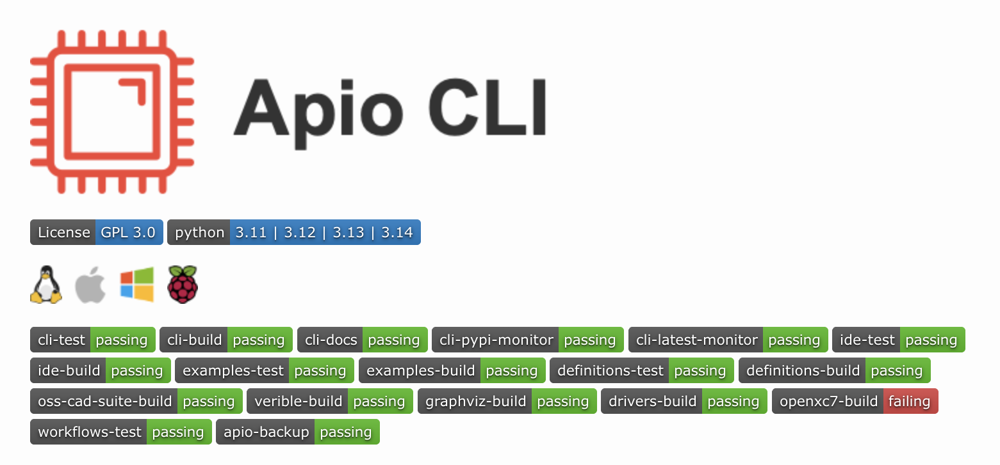

Welcome to the command line! If you want to write Verilog code for the Soan Papdi, **Apio** is going to be your best friend. 

[**Official Apio Documentation ↗**](https://fpgawars.github.io/apio/docs/)

<!-------------------------------------------------------------------------->

 

## The Magic of Apio

Apio is an open-source tool that makes FPGA development incredibly simple. Instead of manually installing and configuring complex, messy toolchains, Apio gives you one clean interface to do it all. 

With just a few simple commands like `apio build` and `apio upload`, you can verify, simulate, compile, and flash your Verilog code straight to your board.

 


**What's happening under the hood?**

While you type simple commands, Apio quietly manages a powerful suite of open-source iCE40 tools for you:
* **Yosys** (Synthesis): Turns your Verilog code into logic gates.
* **nextpnr** (Place-and-Route): Maps those gates to the physical FPGA chip.
* **iceprog** (Flashing): Sends the final design over USB to your board.


<!-------------------------------------------------------------------------->

 

## Why use Apio?


  
  
  
  


