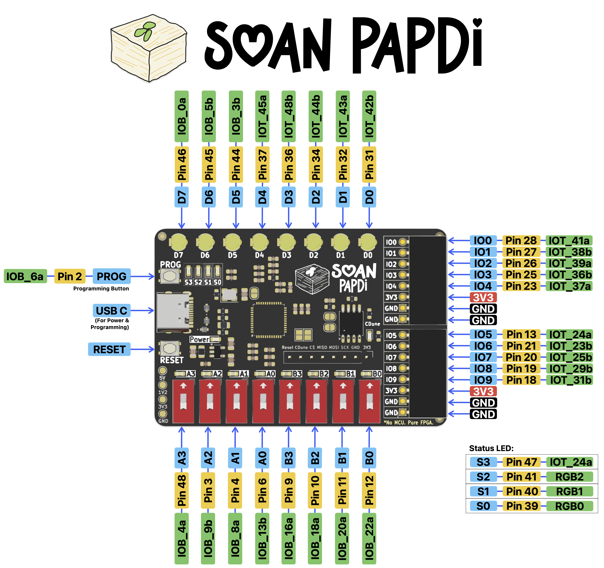
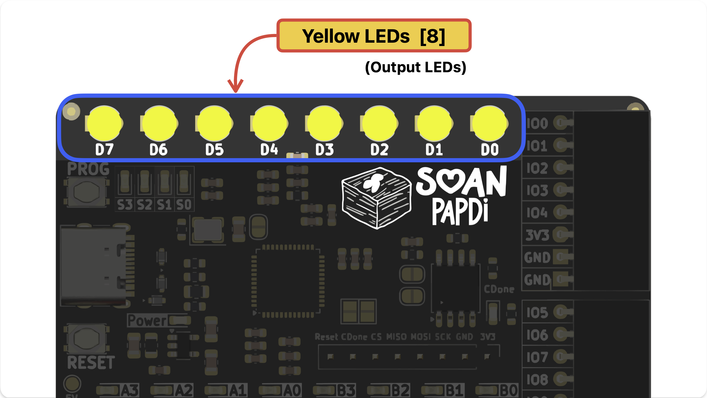
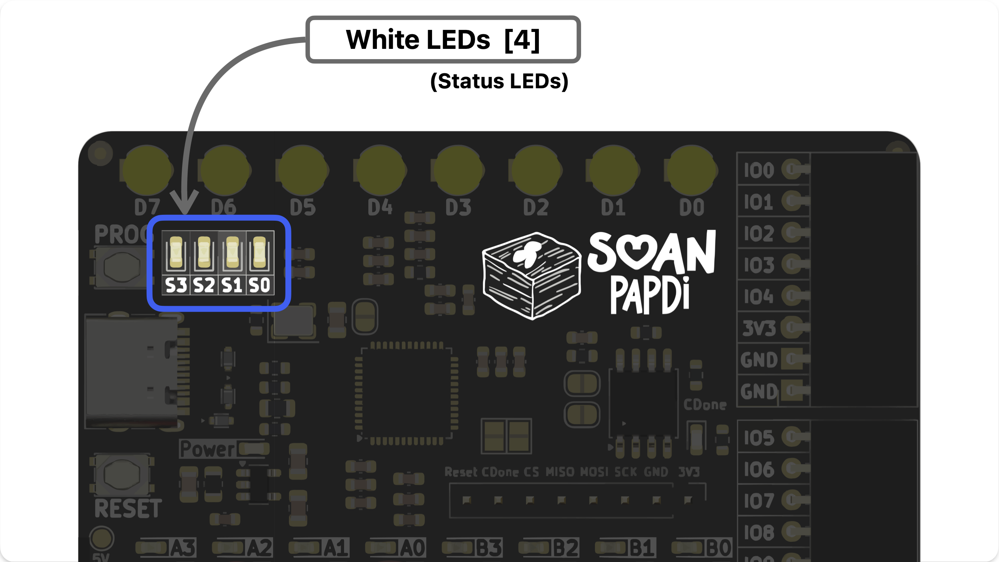
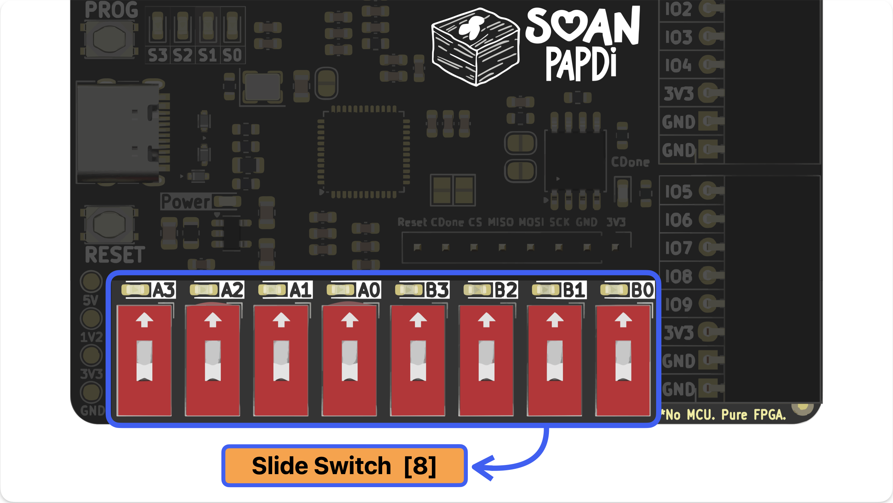
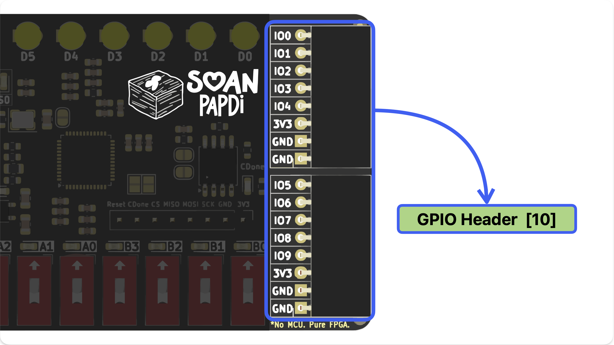

The design is intentional - Just the FPGA, Flash memory, a USB-C port for power and loading circuits, and Basics Input/Output.

 

<!-------------------------------------------------------------------------->

## Pin Diagram

A quick roadmap of the board:

 

<!-------------------------------------------------------------------------->

## Tech Specs at a Glance

Here’s the technical rundown of what’s under the hood.


**What is a LUT?** \
LUTs (Look-Up Tables) are the basic building blocks used to create digital circuits on an FPGA. With 5,280 of them, you have plenty of room for creative projects!



  
  
  
  
  
  
  
  
  
  
  
  
  
   


 

## Board Tour

Let's take a closer look at the different parts of the board:

{}

### Output LEDs (D7–D0)

Along the top edge, you'll find **8 Output LEDs** (labeled D7 through D0). You can program these to light up and show the results of your circuits. 

*Note: These are **active high**, which means sending a "1" in your code turns them on.*

### Status LEDs (S3–S0)

Right next to the main outputs are **4 White Status LEDs**. These are perfect for indicating the health or current state of your design. 

*Note: Unlike the main LEDs, these are **active low**, meaning sending a "0" turns them on.*

### Input Switches (A3–A0 & B3–B0)

At the bottom, we've included **8 Slide Switches** split into two groups (Set A and Set B). These are your primary way to manually send inputs (1s and 0s) directly into your FPGA designs.

### GPIO Pins (IO0–IO9)

Want to connect external sensors, motors, or displays? The right side of the board features **10 General Purpose Input/Output (GPIO) pins**, allowing you to expand your projects far beyond the onboard hardware.

{}

<!-------------------------------------------------------------------------->

 

## Datasheet

For those who want to dive deep into the lowest-level details of the FPGA chip itself:

 

