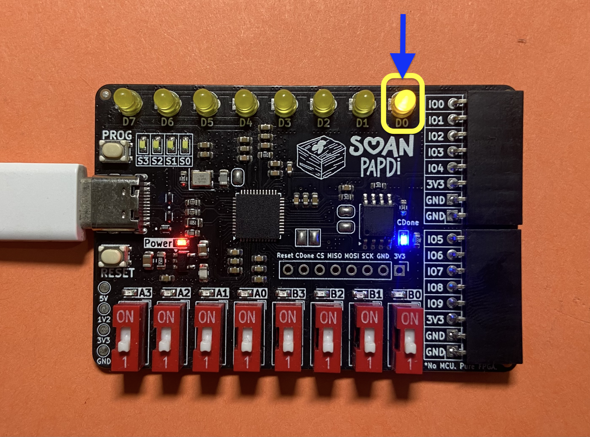
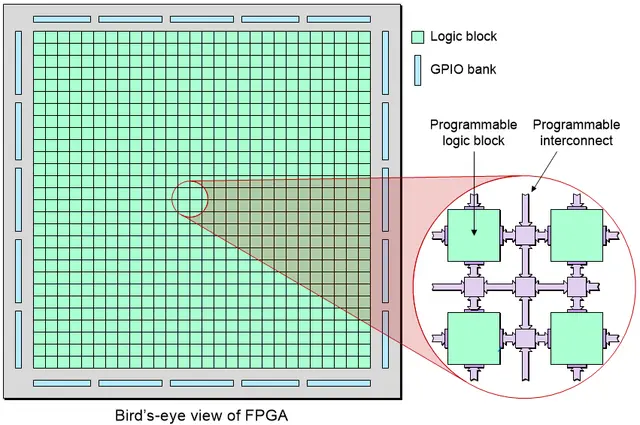
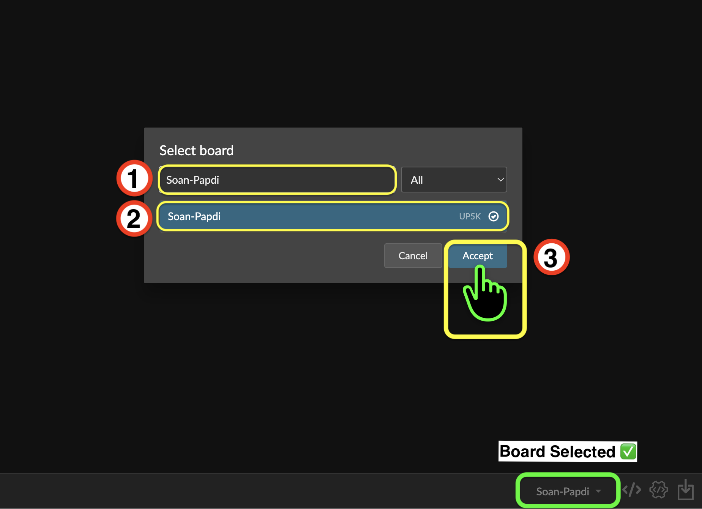
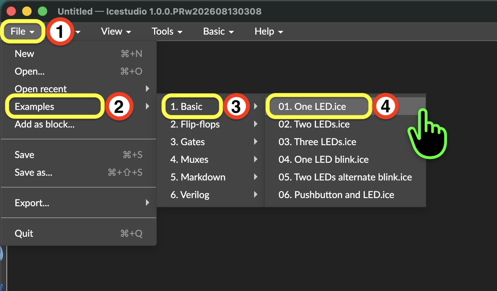
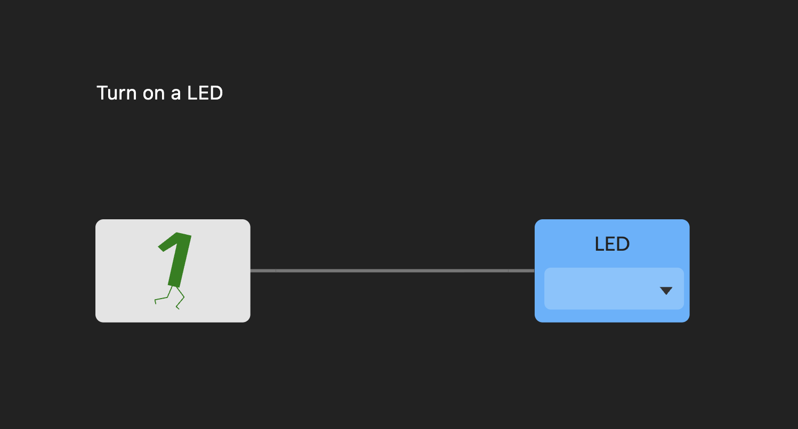
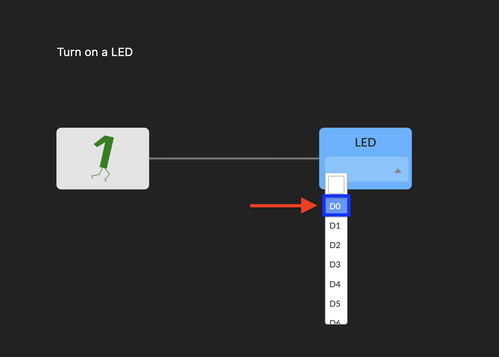
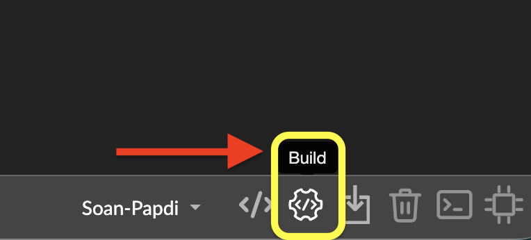
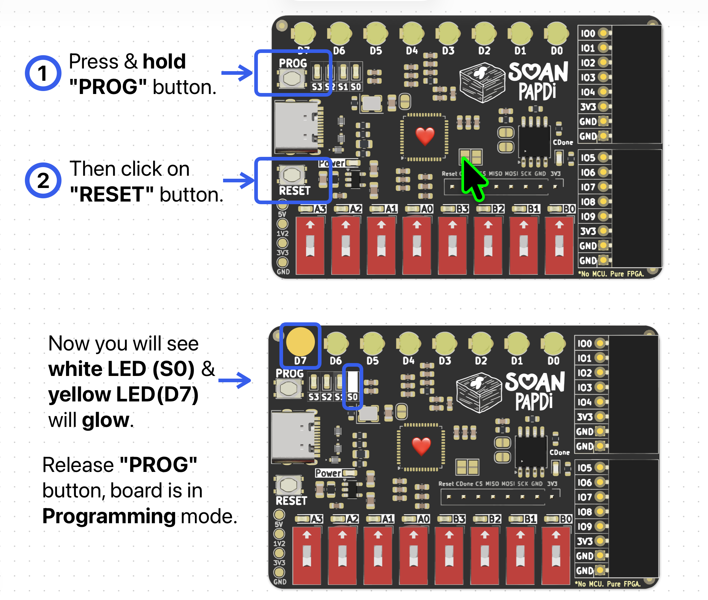

In this project, you'll turn on an onboard LED on the Soan Papdi board using Icestudio's visual logic blocks.


---

### What You Will Need

1. Soan Papdi FPGA Board ➜ [**Link**](https://www.ashoktinkeringlabs.com/soan-papdi)
2. USB Type-C data cable

---

### How FPGAs Work (The Basics)

Before we start clicking buttons, let's understand what we are actually doing. 

Think of an FPGA (Field Programmable Gate Array) as a giant box of digital Lego blocks. Unlike a normal computer chip that reads instructions line-by-line, an FPGA lets you physically wire up electronic circuits inside the chip. 



[Image Source](https://www.latticesemi.com/en/What-is-an-FPGA)

In this project, we are going to create a very simple circuit. We will connect a constant power source directly to the pin where our LED is attached.

---

{}

### Select the Board

  First, we need select the Soan Papdi board.

  1. Look at the bottom-right corner of iCEstudio.
  2. Click on the **Select board** dropdown icon.
  3. Choose **Soan Papdi** from the list.

  

  You will see the `Soan-Papdi` board name confirmed in the bottom-right corner.

  

<br>

### Open the "One LED" Example

  Let's open the "One LED" example from the icestudio examples menu.

  

  When you open this example, icestudio ask you to convert the pin mappings for Soan Papdi.
  
  * Click on **`Convert`** to continue.

  

<br>

### Understand the Blocks

  Let's look at the two blocks on your screen. This is our visual circuit!

  

  **How It Works?**

  * **`Bit 1` :** This block provides a constant digital **High (1)** signal.

    If you double-click the block, you can see the Verilog code behind it. It simply assigns a constant `1` to the output.

    ```verilog
    //-- Constant bit-1
    assign q = 1'b1;
    ```

  * **`LED` :** This is an output block. It takes the signal from the `Bit 1` block and sends it out to a selected physical pin on the FPGA board. 

  **Choose the LED pin:**

  We need to tell the `LED` block *which* physical LED to turn on. 

  1. Click the dropdown on the `LED` block.
  2. Select **D0**. (You can choose other output pins later, but let's stick with D0 for now).

  

<br>

### Build Your Project

  Our circuit is drawn, we need to "Build" it. 

  Building translates our visual blocks into a special file (called a **bitstream**) that the FPGA hardware can actually understand.

  * Click the **Build** button in the bottom-right corner.

  

<br>

### Upload Your Project
    
  Your bitstream is ready. Now, let’s upload it to the **Soan Papdi**.

  #### **Step A: Put the Board in Programming Mode** {class="no-step-marker"}

  Before the board can accept new bitstream, we have to wake up its "programming mode."

  

  Follow these exact steps on your board:

  1. Press and hold the **PROG** button.
  2. While still holding **PROG**, press and release the **RESET** button.
  3. You will see the **S0 white LED** and **D7 yellow LED** glow.
  4. Now, release the **PROG** button.
  5. The **S0, S1, and S2 white LEDs** will start blinking. This means the board is ready and waiting for your project!

  <br>
  <video
    controls
    autoplay
    muted
    loop
    playsinline
    width="100%"
    style="border-radius: 12px; overflow: hidden;">
    <source src="/videos/soan-papdi-programming video.mp4" type="video/mp4">
  </video>

  > [!NOTE]
  > If your project ever fails to upload, always check if you remembered to put the board in programming mode first!

  #### **Step B: Upload the Bitstream** {class="no-step-marker"}

  Now, let's send our project to the board.

  1. Click the **Upload** icon in the bottom-right corner of iCEstudio.
    
  

  Wait for the upload to complete.

  2. Once the upload is complete, press the **RESET** button on the board to start running your new design.

  The blinking programming lights will stop, and your **D0 LED** should now be glowing brightly!
    
  

Congratulations! You have successfully programmed your first FPGA circuit.

{}