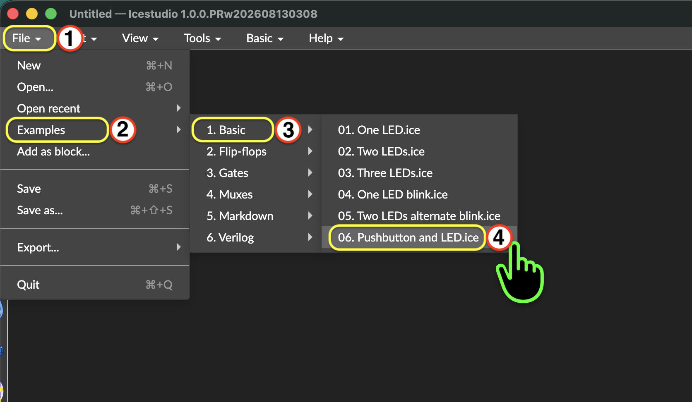
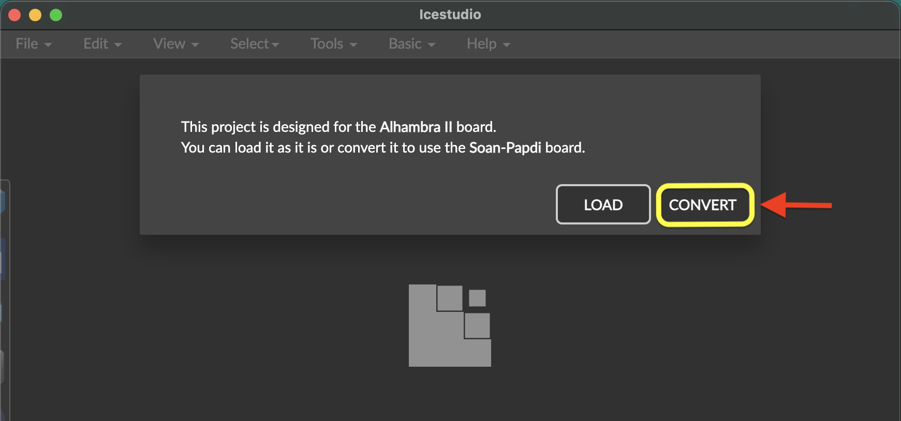
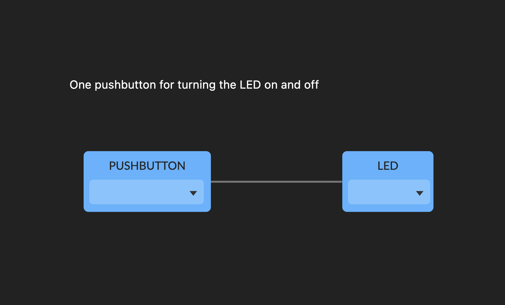
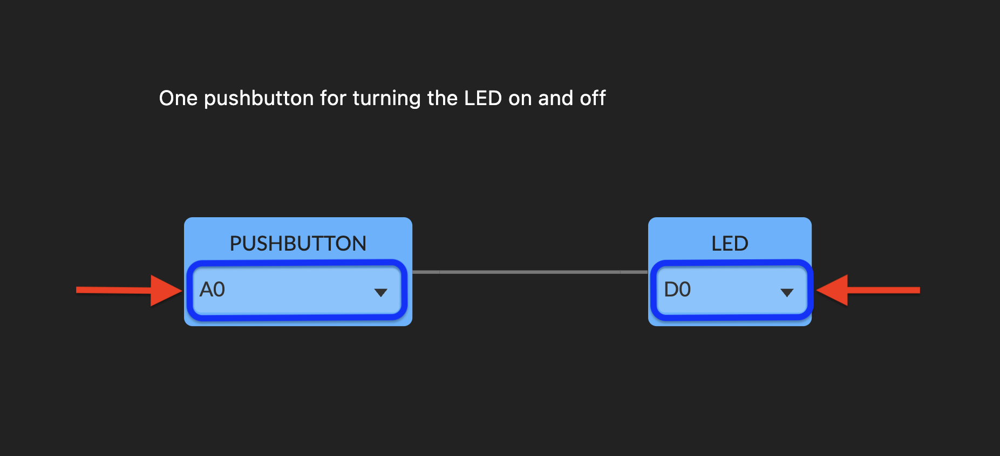

 

  <video
    controls
    autoplay
    muted
    loop
    playsinline
    width="100%"
    style="border-radius: 12px; overflow: hidden;">
    <source src="/videos/examples/led-switch-example.mp4" type="video/mp4">
  </video>

  

    Controlling LED with Switch example.
  

In this project, you'll turn on an onboard LED by using switch on the Soan Papdi board using Icestudio's visual logic blocks.

---

### What You Will Need

1. Soan Papdi FPGA Board ➜ [**Link**](https://www.ashoktinkeringlabs.com/soan-papdi)
2. USB Type-C data cable

---

{}

### Select the Board

  Ensure your target board is set to **Soan Papdi** in the bottom-right corner.

  

  If you haven't set this up yet, see the detailed steps in [Example 1: Getting Started](../01-led/#select-the-board).

 

### Open the "Pushbutton & LED" Example

  Open the Pushbutton & LED example from the Icestudio examples menu:

  

  When you open this example, Icestudio will prompt you to convert the pin mappings for Soan Papdi:

  * Click on **`Convert`** to continue.

  

 

### Understand the Blocks

  

  **How the Circuit Works?**

  * **`PUSHBUTTON`** (Input Block): Reads the switch position. Even though the block is named Pushbutton, it maps to the DIP slide switch on the Soan Papdi.

    <!-- 1. Slide ON ➜ sends high (1)
    2. Slide OFF ➜ sends low (0) -->
    
    1. Slide ON ➜ sends high (1)
    2. Slide OFF ➜ sends low (0)

  * **`Wire:`** Passes the signal straight from the switch to the LED.

  * **`LED`** (Output): Turns ON when it receives 1 and turns OFF when it receives 0.

  **Choose the LED pin:**

  We need to assign physical FPGA pins to both the input and output blocks.

  

  * LED Pin: Click the dropdown on the LED block and select D0.
  * Switch Pin: Click the dropdown on the PUSHBUTTON block and select the A0 pin.

 

### Build Your Project
  
  Click the Build button in the bottom-right corner to convert your visual blocks into an FPGA bitstream.

  

 

### Upload Your Project
    
  Your bitstream is ready. Now, let’s upload it to the **Soan Papdi**.

  #### Step A: Enter Programming Mode {class="no-step-marker"}
  
  Put your board into programming mode before flashing. If you haven't done this before, follow the steps in [Example 1: Getting Started](../01-led/#step-a-put-the-board-in-programming-mode).

   
  
 

  <video
    controls
    autoplay
    muted
    loop
    playsinline
    width="100%"
    style="border-radius: 12px; overflow: hidden;">
    <source src="/videos/soan-papdi-programming video.mp4" type="video/mp4">
  </video>

  

    Soan Papdi in programming mode - blinking white LEDs on S0, S1, and S2.
  

  > If your project ever fails to upload, always check if you remembered to put the board in programming mode first!

  Now, let's send our project to the board.

  #### Step B: Upload the Bitstream  {class="no-step-marker"}

  1. Click the **Upload** icon in the bottom-right corner of iCEstudio.
    
  

  2. Once the upload is complete, press the **RESET** button on the board to start running your new design.

       

  

  <video
    controls
    autoplay
    muted
    loop
    playsinline
    width="100%"
    style="border-radius: 12px; overflow: hidden;">
    <source src="/videos/examples/led-switch-example.mp4" type="video/mp4">
  </video>

  

    Controlling LED with Switch example.
  

{}