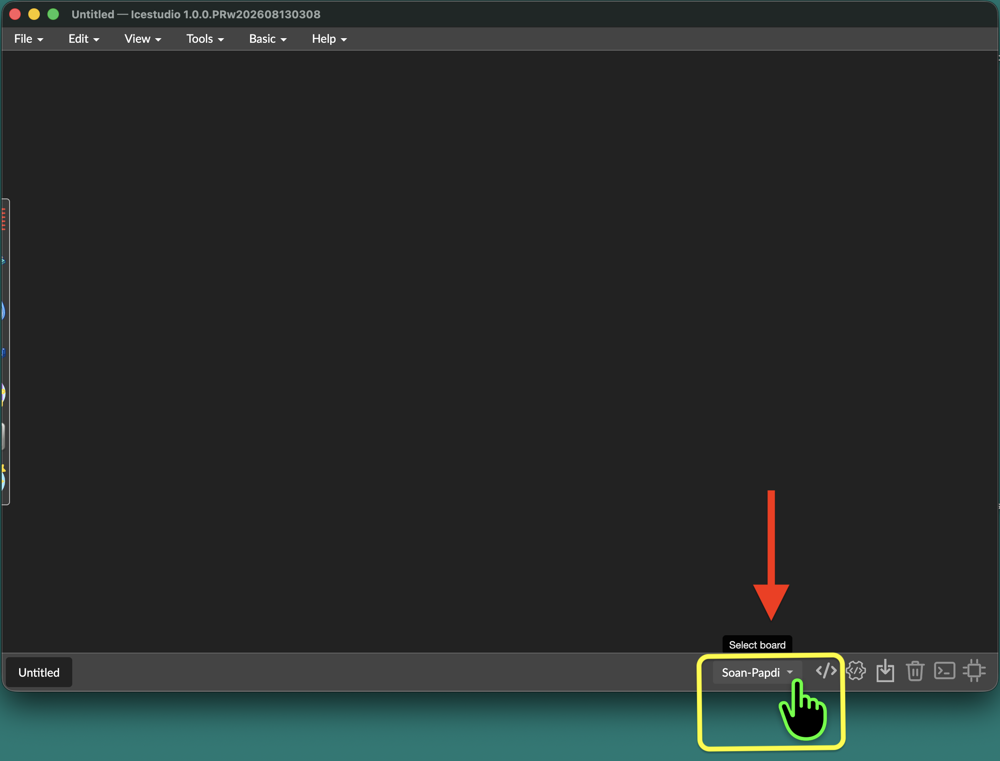
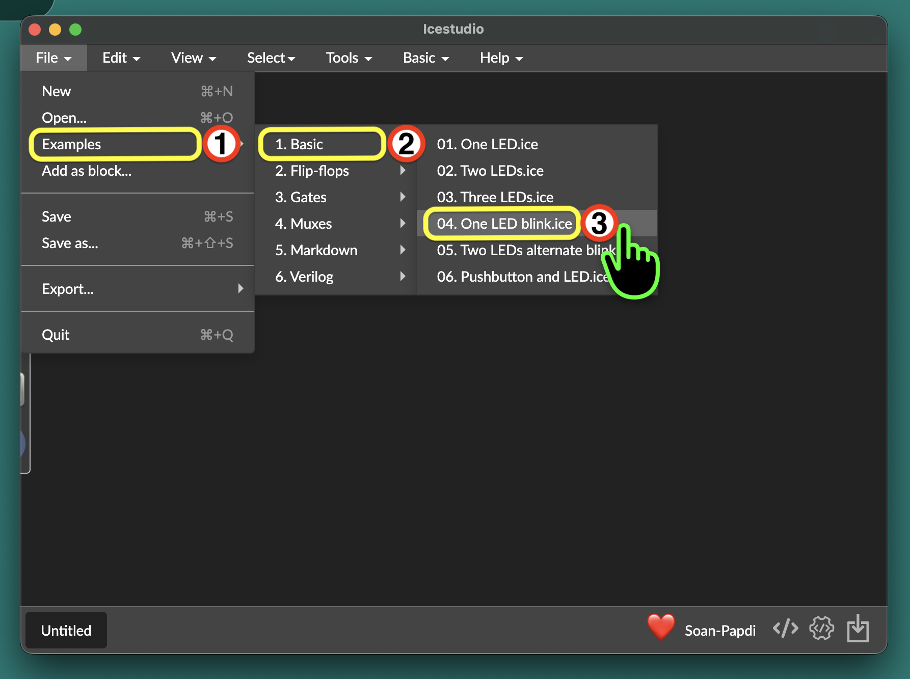
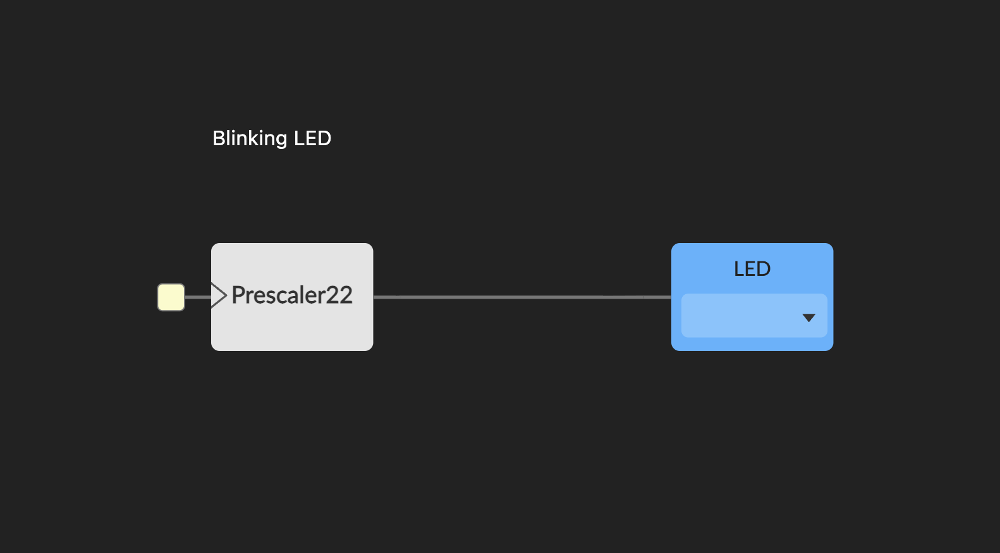
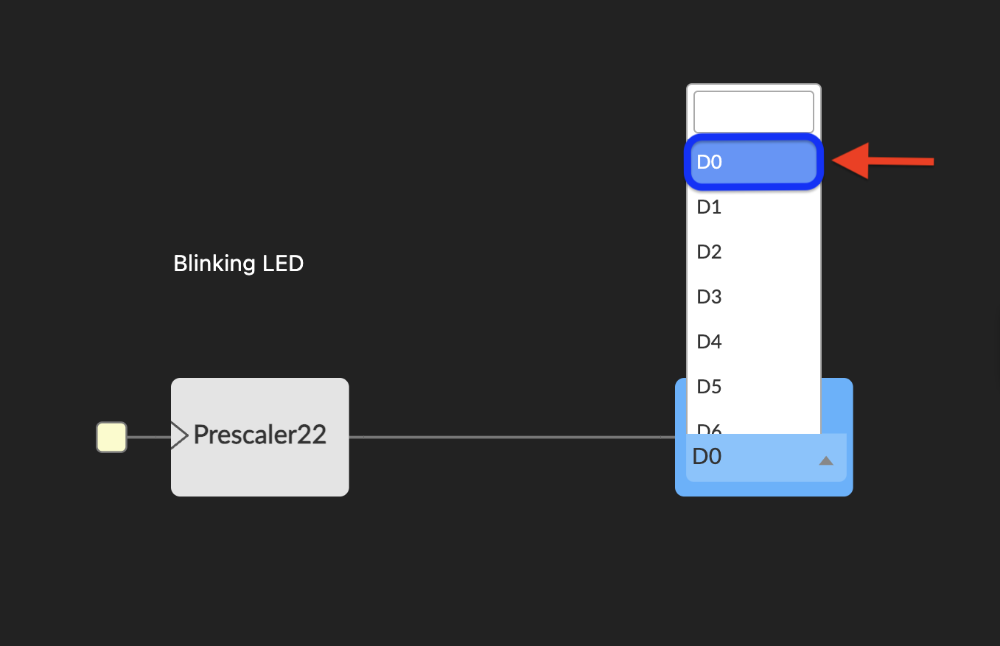
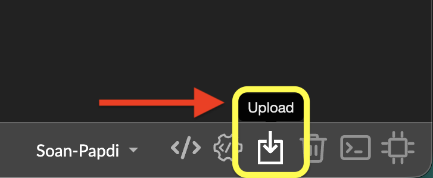

  <video
    controls
    autoplay
    muted
    loop
    playsinline
    width="100%"
    style="border-radius: 12px; overflow: hidden;">
    <source src="/videos/blink-led.mov" type="video/mp4">
  </video>

In this project, we'll build the classic "Hello, World!" of hardware: a blinking LED using Icestudio's blocks.

----

### What You Will Need

1. Soan Papdi FPGA Board ➜ [**Link**](https://www.ashoktinkeringlabs.com/soan-papdi)
2. USB Type-C data cable

---

{}

### Select the Board

  Ensure your target board is set to **Soan Papdi** in the bottom-right corner.

  

  If you haven't set this up yet, see the detailed steps in [Example 1: Getting Started](../01-led/#select-the-board).

### Open the LED Blink Example

  Open the LED Blink example by navigating to: \
  **File → Examples → Basic → 04. One LED Blink.ice**

  

  When you open this example, Icestudio will prompt you to convert the pin mappings for Soan Papdi:

  * Click on **`Convert`** to continue.

  
  

### Understand the Blocks

  

  **How the Circuit Works?**

  * **`Input Clock (Yellow Square)`** : Provides the heartbeat of the FPGA—a fast 12 MHz signal ticking 12 million times every second.

  * **`Prescaler22`** : Acts like a gear reducer. It uses a 22-bit counter to divide the clock by $2^{22}$, dropping 12 MHz down to a human-visible blinks per second.

  * **`LED Block`** : Connects directly to the physical LED pin on the board, flashing the light on and off in sync with the slowed pulses.

  **Choose the LED pin:**

  Select the pin you would like to blink. In this tutorial, we'll use **D0**. but you can choose any other output led.

  

### Build Your Project

  Click the **Build** button in the bottom-right corner.

  

### Upload Your Project
    
  Your bitstream is ready. Now, let’s upload it to the **Soan Papdi**.

  #### Step A: Enter Programming Mode {class="no-step-marker"}
  
  Put your board into programming mode before flashing. If you haven't done this before, follow the steps in [Example 1: Getting Started](../01-led/#step-a-put-the-board-in-programming-mode).

   
  
 

  <video
    controls
    autoplay
    muted
    loop
    playsinline
    width="100%"
    style="border-radius: 12px; overflow: hidden;">
    <source src="/videos/soan-papdi-programming video.mp4" type="video/mp4">
  </video>

  

    Soan Papdi in programming mode - blinking white LEDs on S0, S1, and S2.
  

  > If your project ever fails to upload, always check if you remembered to put the board in programming mode first!

  Now, let's send our project to the board.

  #### Step B: Upload the Bitstream  {class="no-step-marker"}

  1. Click the **Upload** icon in the bottom-right corner of iCEstudio.
    
  

  2. Once the upload is complete, press the **RESET** button on the board to start running your new design.

  Your LED should now be blinking!

   

  <video
    controls
    autoplay
    muted
    loop
    playsinline
    width="100%"
    style="border-radius: 12px; overflow: hidden;">
    <source src="/videos/blink-led.mov" type="video/mp4">
  </video>

{}